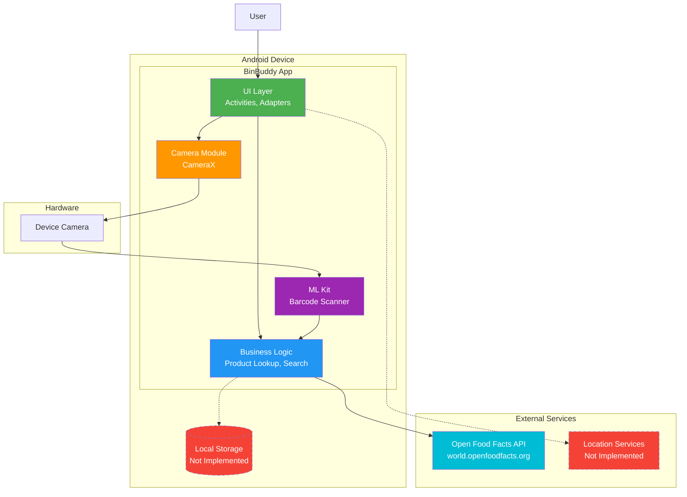

# System Architecture Diagram

## Overview
High-level system architecture showing all components, external services, and data flows in the BinBuddy application.

## Components Description

### Android Device Components
- **UI Layer**: MainActivity, ScannerActivity, ProductSearchActivity, ProductAdapter
- **Business Logic**: Product lookup, search, data parsing (currently in Activities)
- **Camera Module**: CameraX for camera access and preview
- **ML Kit**: Google ML Kit for barcode scanning
- **Local Storage**: Not yet implemented (Room database planned)

### External Services
- **Open Food Facts API**: Free product database, no API key required
- **Location Services**: Planned for location-based features

### Data Flows
1. **Scan Flow**: User → UI → Camera → ML Kit → Business Logic → Open Food Facts → UI
2. **Search Flow**: User → UI → Business Logic → Open Food Facts → UI
3. **Storage Flow**: Business Logic → Local Storage (planned)

## Current vs. Planned
- ✅ **Implemented**: UI, Camera, ML Kit, Open Food Facts integration
- ⚠️ **Planned**: Local Storage, Location Services, Additional APIs
