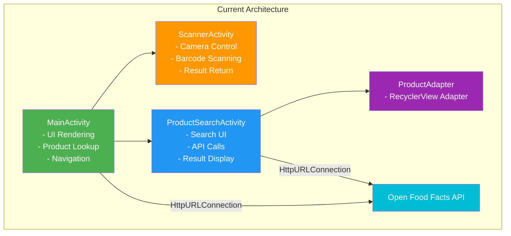
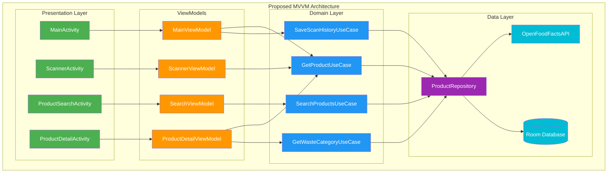

# Application Architecture Diagram

## Current Architecture (Activity-Based)

## Proposed Architecture (MVVM)

## Architecture Comparison

### Current (Activity-Based)
**Pros:**
- Simple and straightforward
- Fast to implement
- No additional dependencies

**Cons:**
- No separation of concerns
- Business logic mixed with UI
- Difficult to test
- State lost on configuration changes
- No data persistence layer

### Proposed (MVVM)
**Pros:**
- Clear separation of concerns
- Testable ViewModels
- Lifecycle-aware components
- State preservation
- Reusable Use Cases
- Centralized data access

**Cons:**
- More complex initial setup
- Requires learning curve
- Additional dependencies (ViewModel, LiveData/StateFlow)

## Migration Path
1. Add ViewModel dependencies
2. Extract business logic to ViewModels
3. Create Repository layer
4. Implement Room database
5. Create Use Cases for business rules
6. Migrate Activities to observe ViewModels
