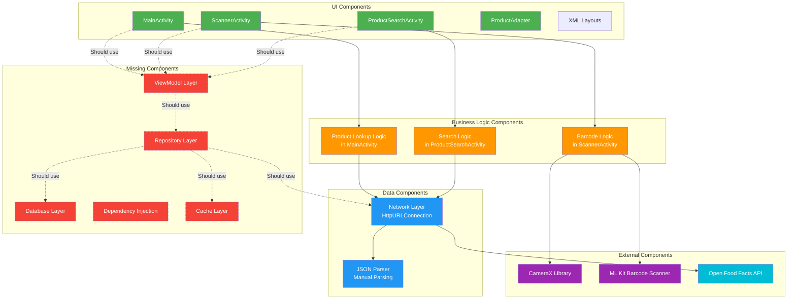

# Component Diagram

## Current Component Structure

## Component Dependencies

### Current Dependencies
- **Activities** depend directly on network layer
- **Activities** contain business logic
- **Network layer** uses HttpURLConnection
- **No abstraction** between layers

### Proposed Dependencies
- **Activities** depend only on ViewModels
- **ViewModels** depend on Use Cases
- **Use Cases** depend on Repository
- **Repository** depends on Data Sources (API, Database, Cache)
- **Dependency Injection** manages all dependencies

## Component Responsibilities

### UI Components
- **MainActivity**: Home screen, navigation, product display
- **ScannerActivity**: Camera preview, barcode scanning UI
- **ProductSearchActivity**: Search input, results list
- **ProductAdapter**: RecyclerView item rendering

### Business Logic Components (Current)
- **Product Lookup**: Fetches product by barcode
- **Search Logic**: Searches products by name
- **Barcode Logic**: Processes camera frames

### Data Components
- **Network Layer**: HTTP requests to Open Food Facts
- **JSON Parser**: Manual JSON parsing (no Gson/Jackson)

### External Components
- **CameraX**: Camera lifecycle and preview
- **ML Kit**: Barcode detection from images
- **Open Food Facts API**: Product database

### Missing Components
- **Repository**: Single source of truth for data
- **Database**: Local storage (Room)
- **ViewModel**: UI state management
- **Dependency Injection**: Hilt/Koin for dependency management
- **Cache**: Offline data caching
