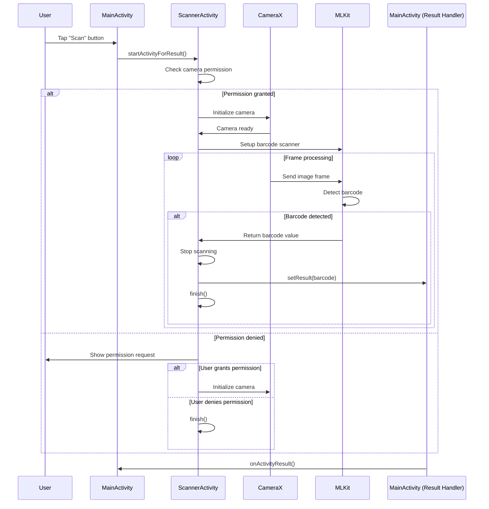
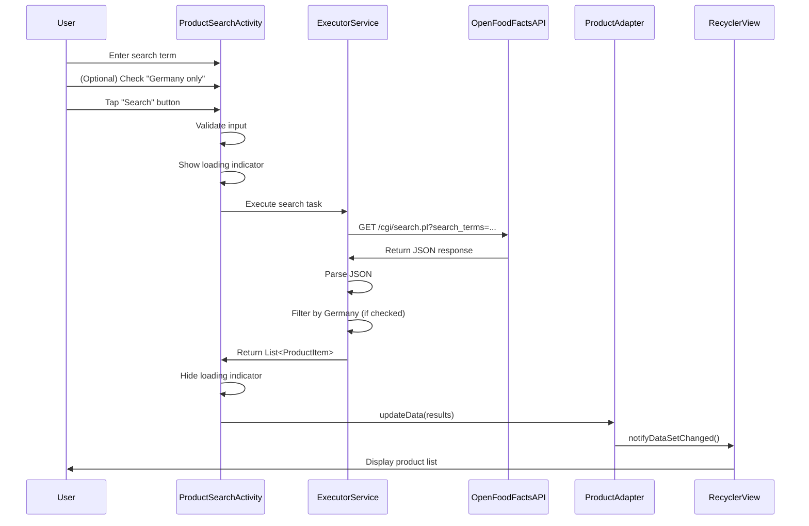
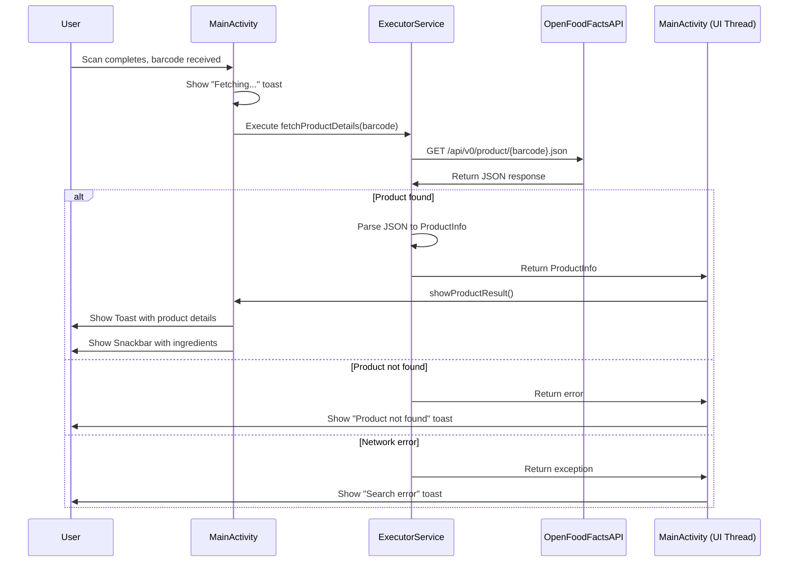
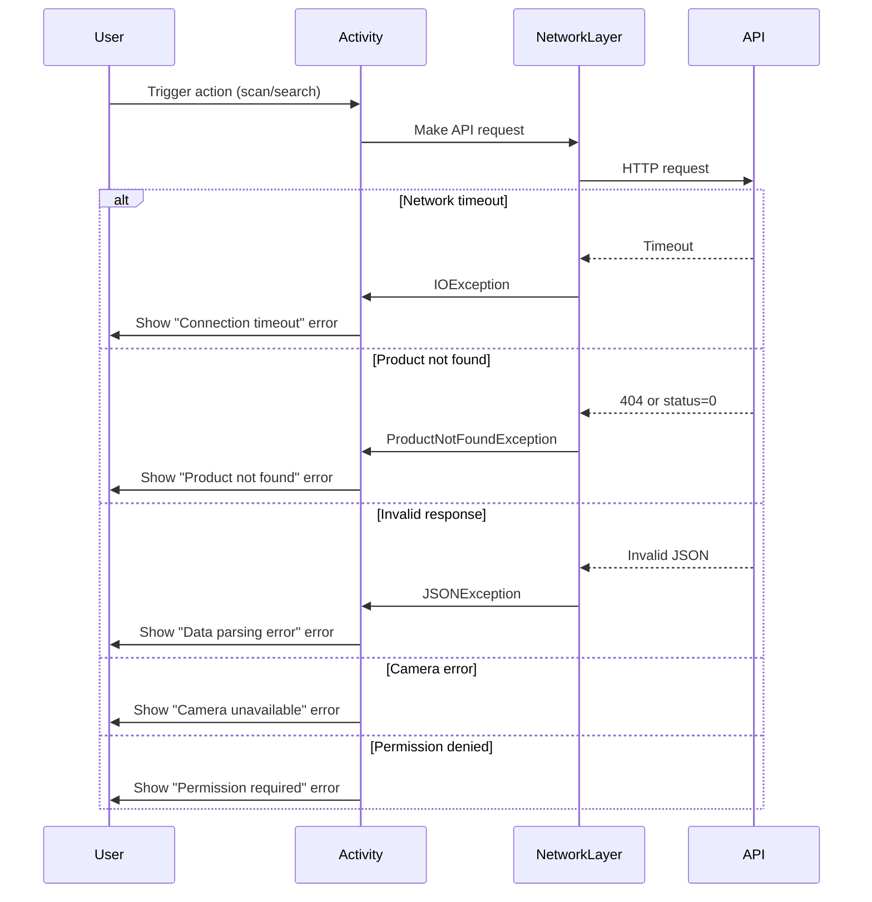
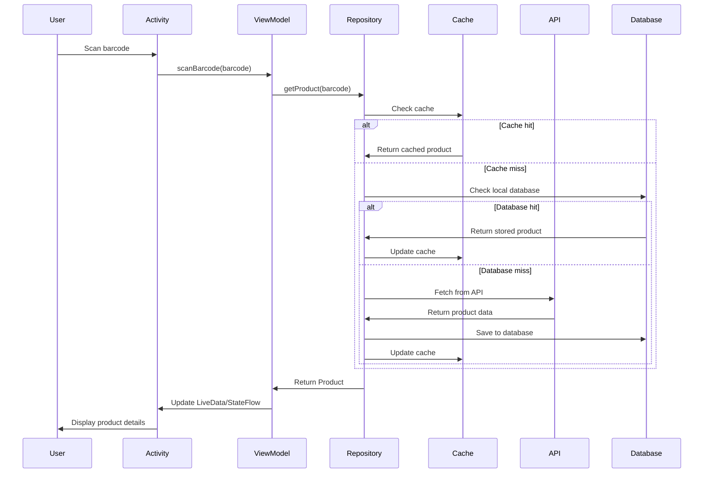

# Sequence Diagrams

## 1. Barcode Scanning Flow

## 2. Product Search Flow

## 3. Product Lookup Flow (After Scan)

## 4. Error Handling Flow

## 5. Proposed Improved Flow (With Repository & ViewModel)

