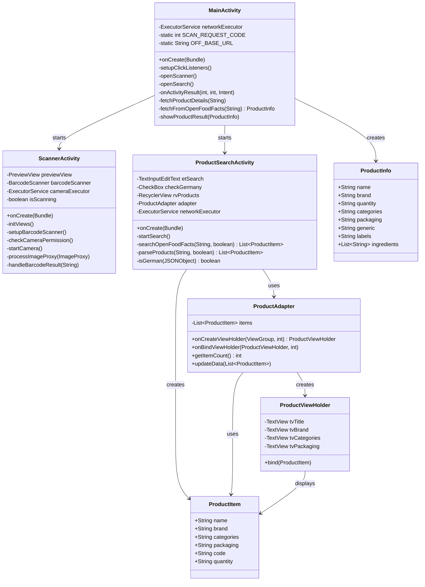
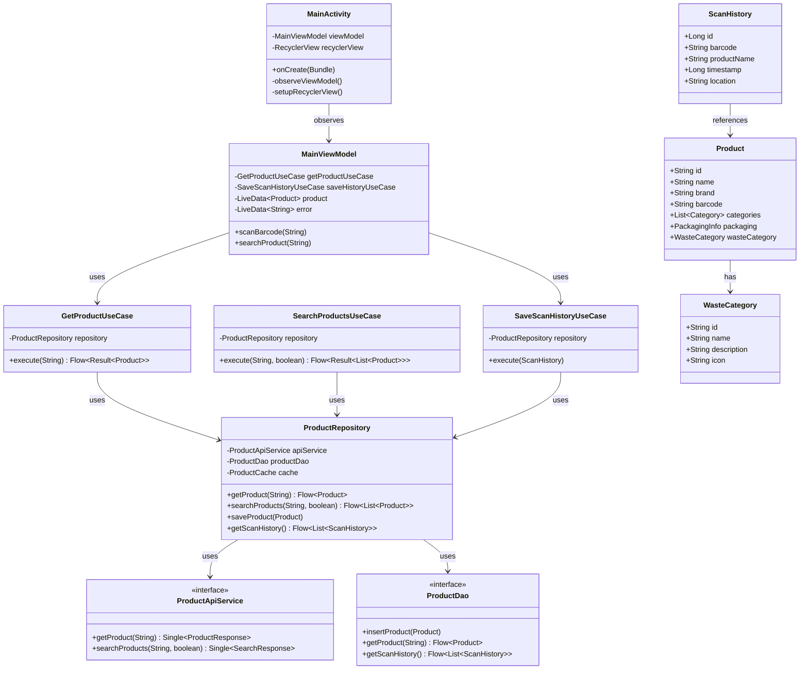

# Class Diagram

## Current Class Structure

## Proposed Class Structure (MVVM)

## Class Relationships

### Current Structure
- **Tight Coupling**: Activities directly handle network calls
- **No Abstraction**: Direct dependency on HttpURLConnection
- **Mixed Responsibilities**: UI and business logic in same class
- **No Persistence**: No database classes

### Proposed Structure
- **Loose Coupling**: Activities only depend on ViewModels
- **Clear Separation**: Use Cases for business logic, Repository for data
- **Testable**: Interfaces allow easy mocking
- **Persistent**: Room database with DAOs

## Key Design Patterns

### Current
- **None**: Procedural code in Activities

### Proposed
- **MVVM**: ViewModel pattern for state management
- **Repository**: Single source of truth for data
- **Use Case**: Business logic encapsulation
- **Observer**: LiveData/StateFlow for reactive UI
- **Dependency Injection**: Hilt/Koin for dependency management
