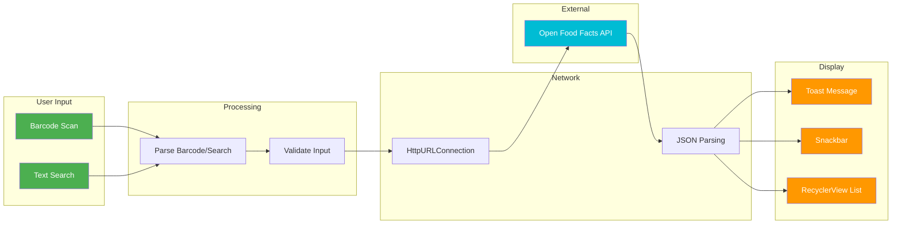
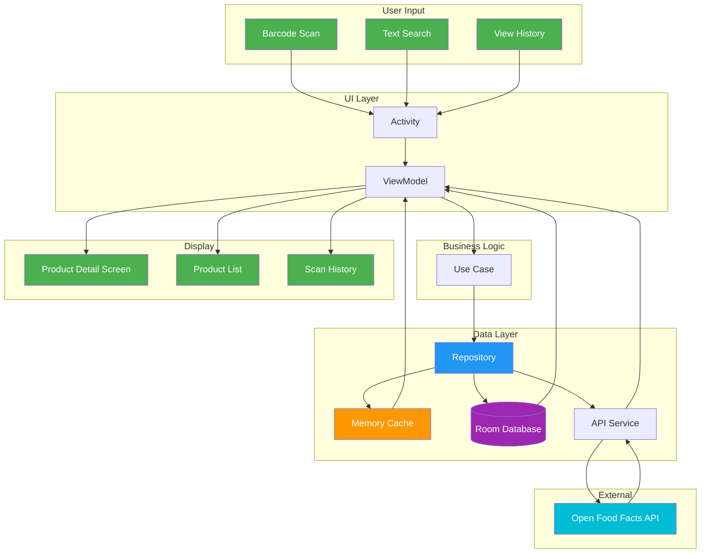
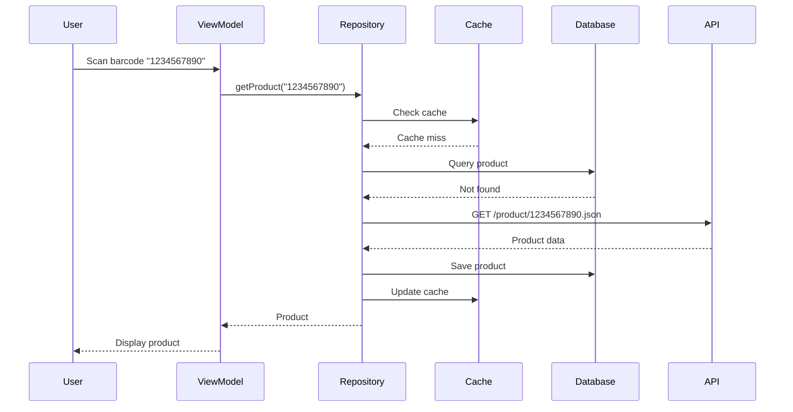
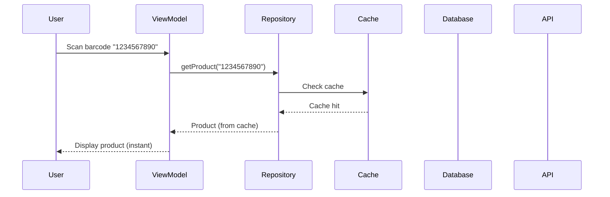
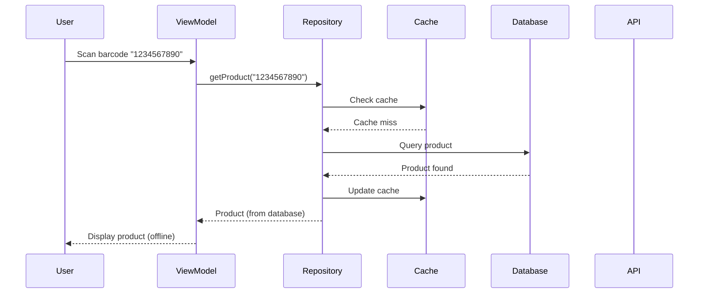

# Data Flow Diagram

## Current Data Flow (No Persistence)

## Proposed Data Flow (With Persistence)

## Data Flow Scenarios

### Scenario 1: First-Time Product Scan

### Scenario 2: Cached Product Lookup

### Scenario 3: Offline Product Lookup

## Data Transformation Points

1. **Barcode → Product ID**: Scanner extracts barcode, used as product identifier
2. **API Response → Domain Model**: JSON parsing converts API response to Product object
3. **Domain Model → UI Model**: Product transformed to display format
4. **Domain Model → Database Entity**: Product converted to Room Entity for storage
5. **Database Entity → Domain Model**: Stored entity converted back to domain model

## Data Storage Strategy

### Current
- **No Storage**: All data fetched fresh from API
- **No Caching**: Every request hits the network
- **No Offline Support**: Requires internet connection

### Proposed
- **Memory Cache**: Fast access for recently viewed products
- **Room Database**: Persistent storage for offline access
- **Cache Invalidation**: TTL-based cache expiration
- **Sync Strategy**: Background sync for cached data
