# User Journey Map

## Complete User Journey: From Installation to Successful Waste Sorting

## Detailed User Journey Stages

### Stage 1: Discovery & Installation

**User Emotions:**
- 😊 Hopeful: "This will help me sort waste correctly"
- 🤔 Curious: "How does this work?"

**Pain Points:**
- May not understand German waste system
- Unfamiliar with app interface

**Opportunities:**
- Onboarding tutorial
- Quick start guide
- Example product scan

### Stage 2: First Product Scan

**User Emotions:**
- 😊 Excited: "This is easy!"
- 😟 Anxious: "Will it work?"
- 😕 Confused: "What do I do with this info?"

**Pain Points:**
- May not know which bin to use
- Product info may be incomplete
- No clear waste category shown

**Opportunities:**
- Show waste category prominently
- Provide bin guide link
- Visual bin icons

### Stage 3: Understanding & Action

**User Emotions:**
- 😊 Confident: "I know where this goes"
- 🤔 Uncertain: "Is this the right bin?"
- 😟 Frustrated: "Still not clear"

**Pain Points:**
- Waste category not explicitly shown
- No visual bin guide
- May need to look up bin rules separately

**Opportunities:**
- Automatic waste category detection
- Integrated bin guide
- Visual bin matching

### Stage 4: Regular Usage

**User Emotions:**
- 😊 Satisfied: "This is helpful"
- 😊 Confident: "I'm learning"
- 😊 Empowered: "I can sort correctly"

**Pain Points:**
- May forget previous scans
- No way to save favorites
- Limited learning resources

**Opportunities:**
- Scan history with favorites
- Learning mode with tips
- Statistics and achievements

## User Journey Touchpoints

### Current Touchpoints
1. ✅ App installation
2. ✅ Home screen
3. ✅ Scanner screen
4. ✅ Product info (Toast/Snackbar)
5. ✅ Search screen
6. ❌ Product detail screen (missing)
7. ❌ Bin guide (missing)
8. ❌ Scan history (missing)

### Proposed Touchpoints
1. Onboarding screens
2. Home screen with quick actions
3. Scanner with manual entry option
4. Product detail screen with images
5. Waste category display
6. Bin guide with visuals
7. Scan history with favorites
8. Search with filters
9. Settings and preferences
10. Help and tutorials

## Emotional Journey Map

```mermaid
graph LR
    A[Installation<br/>😊 Hopeful] --> B[First Scan<br/>🤔 Curious]
    B --> C[Loading<br/>😟 Anxious]
    C --> D[Result<br/>😊 Excited]
    D --> E[Understanding<br/>🤔 Confused]
    E --> F[Action<br/>😊 Confident]
    F --> G[Success<br/>😊 Satisfied]
    
    style A fill:#4CAF50,color:#fff
    style G fill:#4CAF50,color:#fff
    style C fill:#FF9800,color:#fff
    style E fill:#FF9800,color:#fff
```

## Pain Points & Solutions

| Pain Point | Current State | Proposed Solution |
|------------|---------------|-------------------|
| Don't know which bin | No waste category shown | Auto-detect and display waste category |
| Product not found | Generic error message | Helpful suggestions, manual entry |
| Offline not working | No offline support | Cache products, offline mode |
| Can't remember previous scans | No history | Scan history with search |
| Complex waste rules | No guide | Integrated bin guide with visuals |
| Language barrier | English UI only | Multi-language support |
