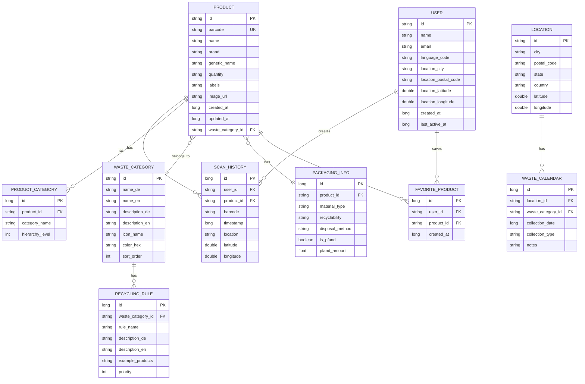

# Database Schema Diagram

## Proposed Room Database Schema



## Entity Relationships

### Core Entities

#### Product
- **Primary Key**: `id` (UUID)
- **Unique Constraint**: `barcode`
- **Relationships**:
  - One-to-Many with `ScanHistory`
  - One-to-Many with `ProductCategory`
  - Many-to-One with `WasteCategory`
  - One-to-One with `PackagingInfo`
  - Many-to-Many with `User` (via `FavoriteProduct`)

#### ScanHistory
- **Primary Key**: `id` (Auto-increment)
- **Indexes**: `user_id`, `product_id`, `timestamp`
- **Relationships**:
  - Many-to-One with `User`
  - Many-to-One with `Product`

#### WasteCategory
- **Primary Key**: `id` (String: "gelbe_tonne", "restmuell", etc.)
- **Predefined Values**:
  - `gelbe_tonne` - Yellow bin (packaging)
  - `restmuell` - Residual waste
  - `papier` - Paper
  - `bio` - Organic waste
  - `glas` - Glass
  - `pfand` - Deposit return

### Supporting Entities

#### User
- **Primary Key**: `id` (UUID)
- **Optional**: Can work without user accounts (guest mode)

#### Location
- **Primary Key**: `id` (String: postal code + city)
- **Used for**: Waste calendar, local rules

## Database Indexes

```sql
-- Performance indexes
CREATE INDEX idx_scan_history_user_timestamp ON scan_history(user_id, timestamp DESC);
CREATE INDEX idx_scan_history_product ON scan_history(product_id);
CREATE INDEX idx_product_barcode ON product(barcode);
CREATE INDEX idx_product_waste_category ON product(waste_category_id);
CREATE INDEX idx_favorite_user_product ON favorite_product(user_id, product_id);
CREATE INDEX idx_waste_calendar_location_date ON waste_calendar(location_id, collection_date);
```

## Data Migration Strategy

### Version 1: Initial Schema
- Product table
- ScanHistory table
- Basic indexes

### Version 2: Add User Support
- User table
- FavoriteProduct table
- Update ScanHistory with user_id

### Version 3: Add Location Features
- Location table
- WasteCalendar table
- Update User with location

### Version 4: Add Waste Classification
- WasteCategory table
- RecyclingRule table
- Update Product with waste_category_id

## Room Entity Examples

### Product Entity (Kotlin)
```kotlin
@Entity(
    tableName = "product",
    indices = [Index(value = ["barcode"], unique = true)]
)
data class ProductEntity(
    @PrimaryKey val id: String,
    val barcode: String,
    val name: String,
    val brand: String?,
    val genericName: String?,
    val quantity: String?,
    val labels: String?,
    val imageUrl: String?,
    val wasteCategoryId: String?,
    val createdAt: Long,
    val updatedAt: Long
)
```

### ScanHistory Entity (Kotlin)
```kotlin
@Entity(
    tableName = "scan_history",
    indices = [
        Index(value = ["userId", "timestamp"]),
        Index(value = ["productId"])
    ],
    foreignKeys = [
        ForeignKey(
            entity = ProductEntity::class,
            parentColumns = ["id"],
            childColumns = ["productId"],
            onDelete = ForeignKey.CASCADE
        )
    ]
)
data class ScanHistoryEntity(
    @PrimaryKey(autoGenerate = true) val id: Long = 0,
    val userId: String?,
    val productId: String?,
    val barcode: String,
    val timestamp: Long,
    val location: String?,
    val latitude: Double?,
    val longitude: Double?
)
```

## Data Access Objects (DAOs)

### ProductDao
- `getProduct(barcode: String): Flow<ProductEntity?>`
- `insertProduct(product: ProductEntity)`
- `updateProduct(product: ProductEntity)`
- `searchProducts(query: String): Flow<List<ProductEntity>>`
- `getProductsByWasteCategory(categoryId: String): Flow<List<ProductEntity>>`

### ScanHistoryDao
- `getScanHistory(userId: String?): Flow<List<ScanHistoryEntity>>`
- `insertScan(scan: ScanHistoryEntity)`
- `deleteScan(id: Long)`
- `getRecentScans(limit: Int): Flow<List<ScanHistoryEntity>>`

### WasteCategoryDao
- `getAllCategories(): Flow<List<WasteCategoryEntity>>`
- `getCategory(id: String): Flow<WasteCategoryEntity?>`
