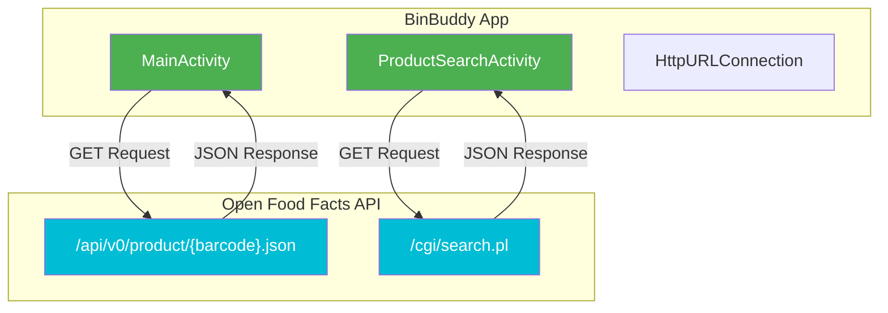
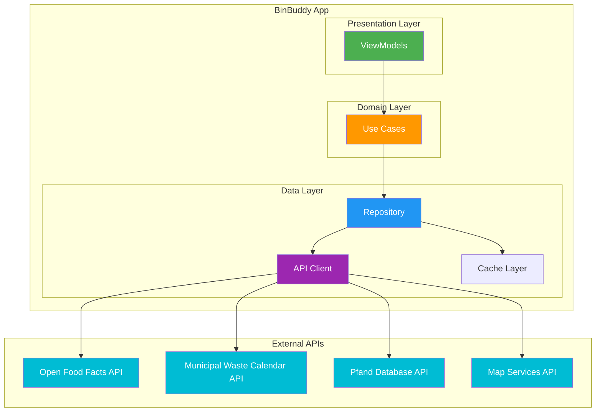
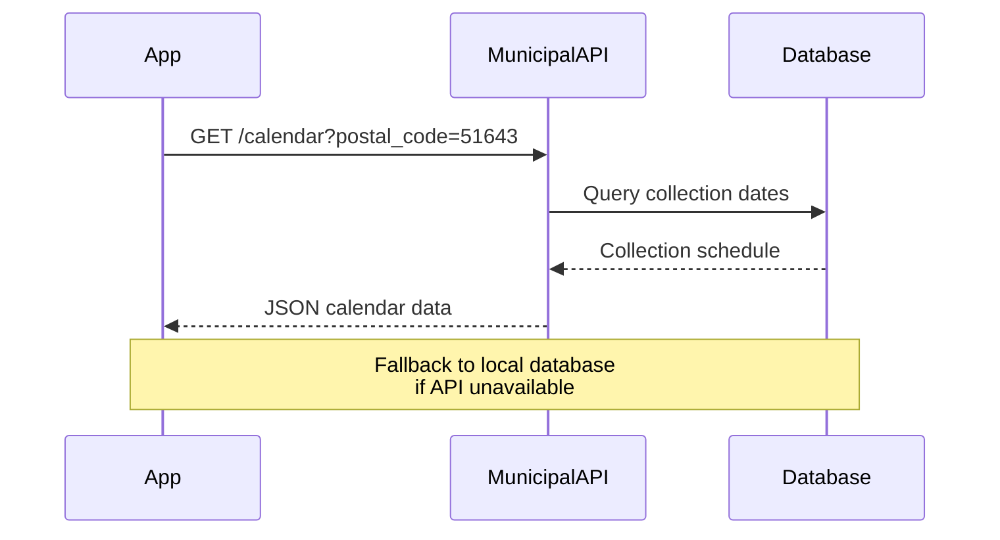
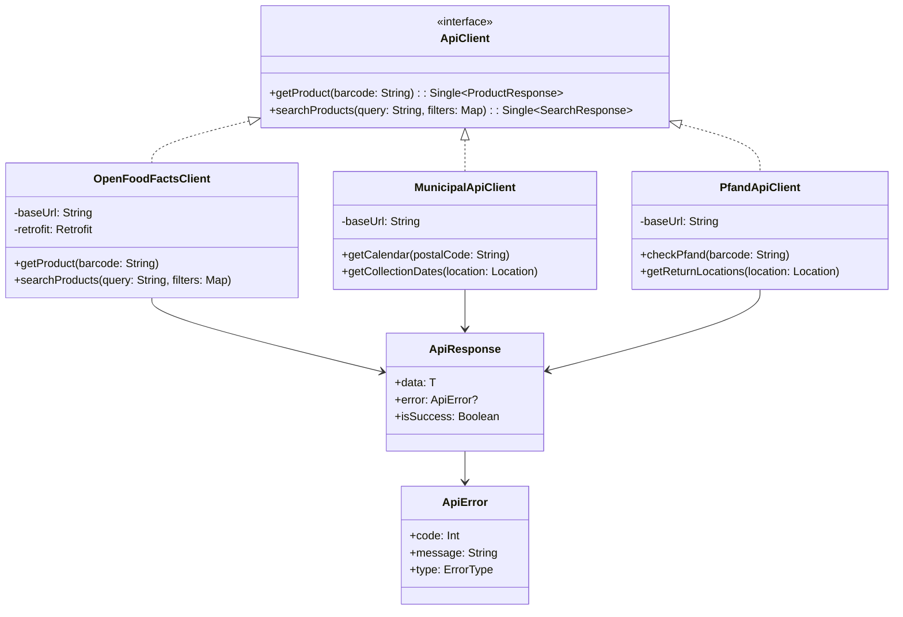
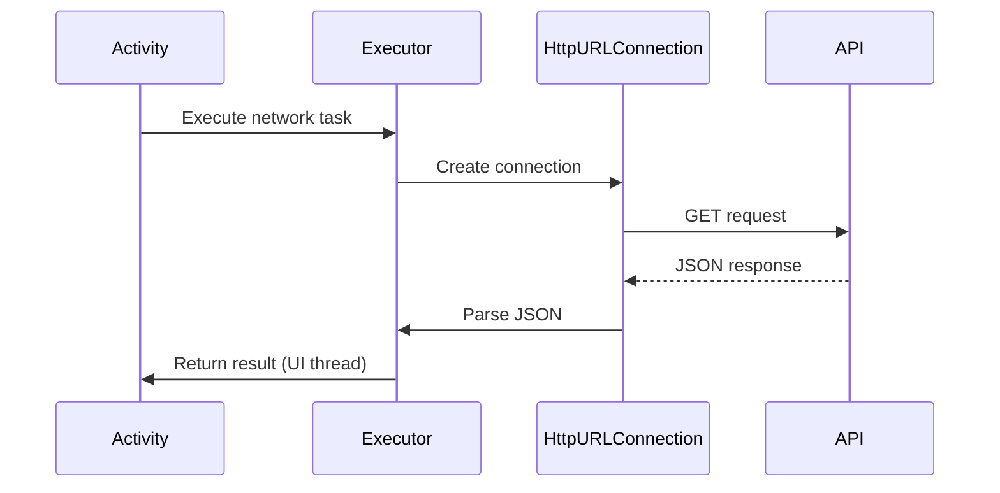
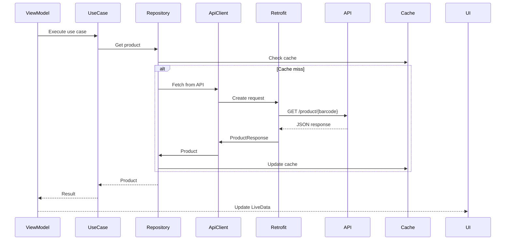
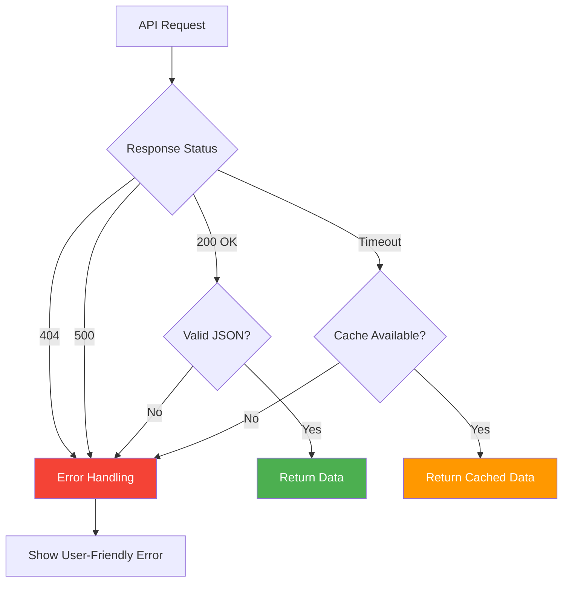

# API Integration Diagram

## Current API Integration



## Current API Endpoints

### 1. Product Lookup by Barcode

```http
GET https://world.openfoodfacts.org/api/v0/product/{barcode}.json

Request:
- barcode: EAN-13, EAN-8, UPC-A, UPC-E

Response:
{
  "status": 1,
  "product": {
    "product_name": "Coca-Cola",
    "brands": "Coca-Cola",
    "barcode": "5449000000996",
    "categories": "Beverages, Carbonated drinks",
    "packaging": "Plastic bottle",
    "quantity": "500ml",
    "ingredients": [...],
    "labels": "Organic",
    "generic_name": "Carbonated soft drink"
  }
}
```

### 2. Product Search

```http
GET https://world.openfoodfacts.org/cgi/search.pl?
    search_terms={query}&
    search_simple=1&
    action=process&
    json=1&
    page_size=25&
    countries=Germany

Request Parameters:
- search_terms: Product name or keyword
- countries: Optional filter (e.g., "Germany")
- page_size: Number of results (default: 25)

Response:
{
  "products": [
    {
      "product_name": "...",
      "brands": "...",
      "code": "...",
      ...
    }
  ],
  "count": 25,
  "page": 1
}
```

## Proposed API Integration Architecture



## Proposed Additional APIs

### 1. Municipal Waste Calendar API



**Potential Sources:**

- Municipal websites (scraping)
- Open Data portals
- Custom API if available

### 2. Pfand Database API

```http
GET /pfand/check?barcode={barcode}

Response:
{
  "has_pfand": true,
  "pfand_amount": 0.25,
  "return_locations": [
    {
      "name": "Supermarket XYZ",
      "address": "...",
      "latitude": 51.123,
      "longitude": 7.456
    }
  ]
}
```

### 3. Map Services (Google Maps / OpenStreetMap)

```http
GET /places/search?query=pfand+return&location={lat},{lng}

Response:
{
  "places": [
    {
      "name": "...",
      "address": "...",
      "coordinates": {...}
    }
  ]
}
```

## API Client Architecture



## API Request/Response Flow

### Current Flow (Simple)



### Proposed Flow (With Retrofit + RxJava/Coroutines)



## Error Handling Strategy



## API Rate Limiting & Caching

### Current

- ❌ No rate limiting
- ❌ No caching
- ❌ No retry logic
- ❌ No offline support

### Proposed

- ✅ Request caching (1 hour TTL)
- ✅ Exponential backoff retry
- ✅ Offline-first with cache
- ✅ Rate limiting (respect API limits)
- ✅ Request queuing for offline requests

## API Response Models

### ProductResponse

```kotlin
data class ProductResponse(
    val status: Int,
    val statusVerbose: String?,
    val product: ProductDto?
)

data class ProductDto(
    val barcode: String,
    val productName: String?,
    val brands: String?,
    val categories: String?,
    val packaging: String?,
    val quantity: String?,
    val ingredients: List<IngredientDto>?,
    val labels: String?,
    val genericName: String?,
    val imageUrl: String?
)
```

### SearchResponse

```kotlin
data class SearchResponse(
    val products: List<ProductDto>,
    val count: Int,
    val page: Int,
    val pageSize: Int
)
```
