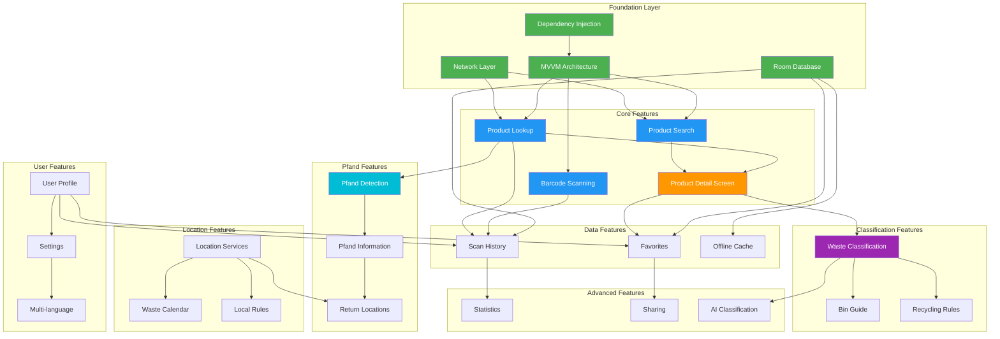
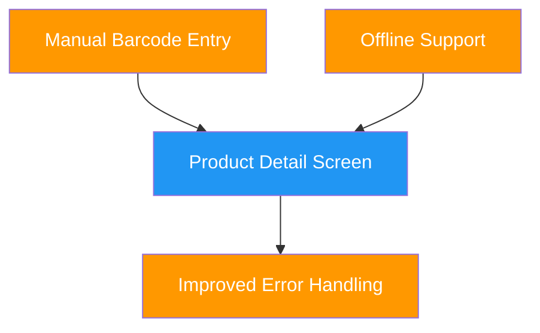
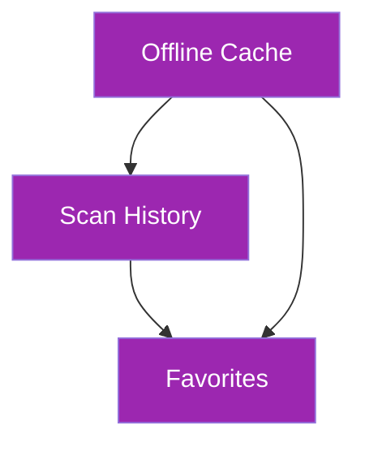
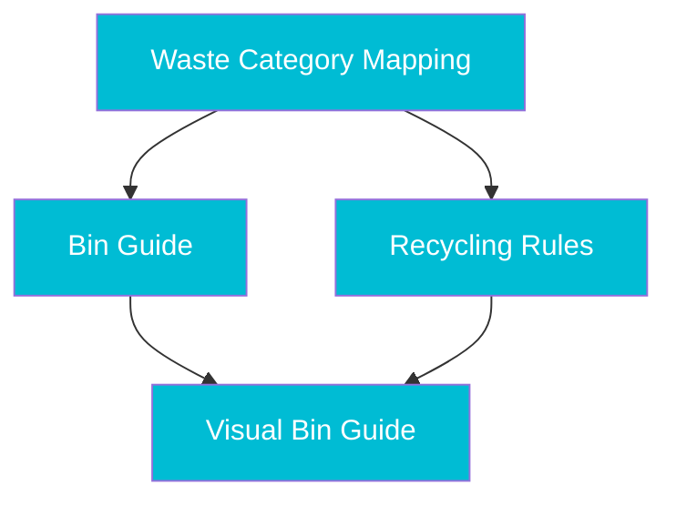
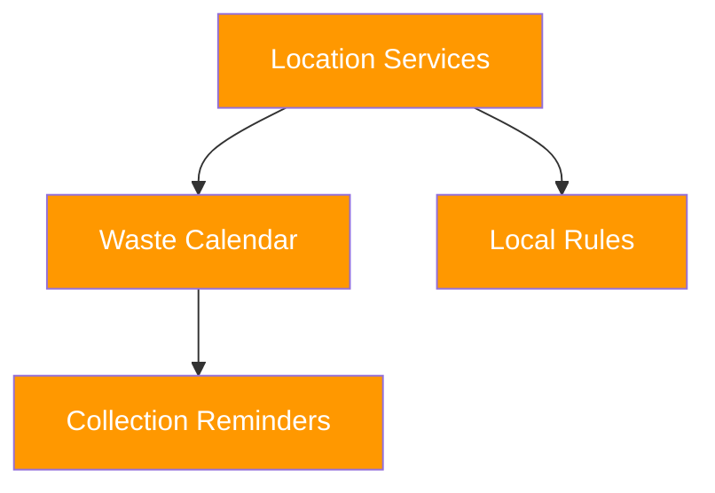
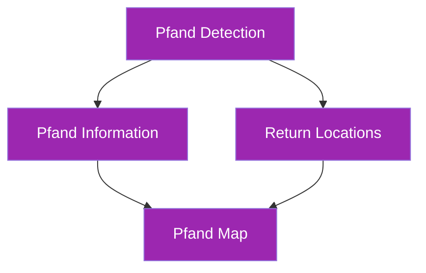
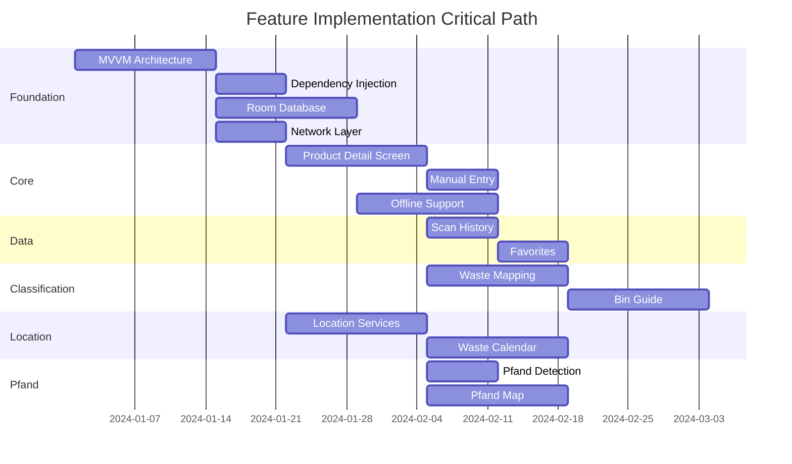

# Feature Dependency Graph

## Feature Implementation Dependencies

## Implementation Phases

### Phase 1: Foundation (Prerequisites)

**Dependencies:**
- No dependencies (foundation layer)

**Blocking:**
- All other features depend on this

### Phase 2: Core Features Enhancement

**Dependencies:**
- Requires: Foundation Layer
- Blocks: History, Favorites, Waste Classification

### Phase 3: Data Persistence

**Dependencies:**
- Requires: Foundation Layer, Product Detail Screen
- Blocks: Statistics, User Profile

### Phase 4: Waste Classification

**Dependencies:**
- Requires: Product Detail Screen, Database
- Blocks: AI Classification

### Phase 5: Location Features

**Dependencies:**
- Requires: Foundation Layer, Database
- Can be developed in parallel with Phase 4

### Phase 6: Pfand System

**Dependencies:**
- Requires: Product Lookup, Location Services
- Can be developed in parallel with Phase 5

## Critical Path Analysis

## Dependency Matrix

| Feature | Depends On | Blocks | Priority |
|---------|-----------|--------|----------|
| MVVM Architecture | None | All features | Critical |
| Dependency Injection | MVVM | All features | Critical |
| Room Database | MVVM | History, Favorites, Cache | Critical |
| Network Layer | MVVM | Lookup, Search | Critical |
| Product Detail Screen | Foundation | History, Favorites, Waste | High |
| Scan History | Detail Screen, Database | Statistics | High |
| Waste Classification | Detail Screen, Database | Bin Guide | High |
| Location Services | Foundation | Calendar, Pfand Map | Medium |
| Pfand Detection | Product Lookup | Pfand Info, Map | Medium |
| User Profile | History, Favorites | Settings | Low |
| Statistics | History | None | Low |
| AI Classification | Waste Classification | None | Low |

## Feature Groups (Can be developed in parallel)

### Group 1: Foundation (Sequential)
1. MVVM Architecture
2. Dependency Injection
3. Room Database
4. Network Layer

### Group 2: Core Features (Parallel after Group 1)
1. Product Detail Screen
2. Manual Barcode Entry
3. Offline Support

### Group 3: Data Features (Parallel after Group 2)
1. Scan History
2. Favorites
3. Offline Cache

### Group 4: Classification (Parallel after Group 2)
1. Waste Category Mapping
2. Bin Guide
3. Recycling Rules

### Group 5: Location (Parallel after Group 1)
1. Location Services
2. Waste Calendar
3. Local Rules

### Group 6: Pfand (Parallel after Group 2 & 5)
1. Pfand Detection
2. Pfand Information
3. Return Locations Map

## Risk Assessment

### High Risk (Many Dependencies)
- **Waste Classification**: Depends on Detail Screen, Database, Product Data
- **Pfand Map**: Depends on Location, Pfand Detection, Map Services

### Medium Risk (Some Dependencies)
- **Scan History**: Depends on Database, Detail Screen
- **Waste Calendar**: Depends on Location, Calendar API

### Low Risk (Few Dependencies)
- **Statistics**: Depends only on History
- **Sharing**: Depends only on Product Detail
- **Settings**: Depends only on Profile

## Implementation Recommendations

1. **Start with Foundation**: Complete MVVM, DI, Database, Network first
2. **Enhance Core**: Add Detail Screen, Manual Entry, Offline
3. **Add Persistence**: Implement History and Favorites
4. **Classification**: Build waste classification system
5. **Location**: Add location-based features
6. **Pfand**: Implement Pfand system
7. **Polish**: Add Profile, Settings, Statistics, Sharing
